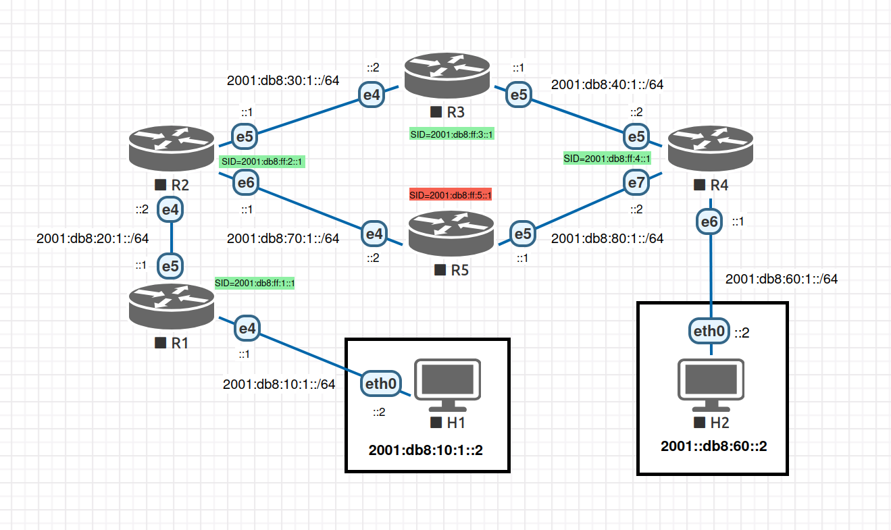

<h1 align="center">SRv6 Proof-of-Transit TLV</h1>
<h3 align="center">Based on BLAKE3 Keyed-hash through eBPF XDP and TC</h3>

This project demonstrates a mechanism for achieving **Proof-of-Transit (PoT)** in an **SRv6 (Segment Routing over IPv6)** network using **eBPF  (Extended Berkeley Packet Filter)** attached to Linux **TC (Traffic Control)** and **XDP (eXpress Data Path)** hooks.

The core idea is to embed a custom **Type-Length-Value (TLV)** object within the **Segment Routing Header (SRH)** at specific nodes in the path. This **TLV** contains metadata (like timestamps, tokens) and a cryptographic hash (using the fast **BLAKE3 Keyed-hash** algorithm) that allows downstream nodes to potentially verify the path taken by the packet.

## This implementation focus on:

1.  **TLV Insertion (`seg6_snode` - TC):** An eBPF program attached to the *egress* TC hook identifies SRv6 packets and injects the custom **BLAKE3 PoT TLV** right after the SRH.
2.  **PoT Validation (`seg6_dnode` - XDP):** An eBPF program attached to the *ingress* XDP hook that performs a full PoT verification.

## Structure of the new TLV

```bash
            RFC 8754 - IPv6 Segment Routing Header (SRH)
  0                   1                   2                   3
  0 1 2 3 4 5 6 7 8 9 0 1 2 3 4 5 6 7 8 9 0 1 2 3 4 5 6 7 8 9 0 1
 +-+-+-+-+-+-+-+-+-+-+-+-+-+-+-+-+-+-+-+-+-+-+-+-+-+-+-+-+-+-+-+-+
 | Next Header   |  Hdr Ext Len  | Routing Type  | Segments Left |
 +-+-+-+-+-+-+-+-+-+-+-+-+-+-+-+-+-+-+-+-+-+-+-+-+-+-+-+-+-+-+-+-+
 |  Last Entry   |     Flags     |              Tag              |
 +-+-+-+-+-+-+-+-+-+-+-+-+-+-+-+-+-+-+-+-+-+-+-+-+-+-+-+-+-+-+-+-+
 |                                                               |
 |            Segment List[0] (128-bit IPv6 address)             |
 |                                                               |
 |                                                               |
 +-+-+-+-+-+-+-+-+-+-+-+-+-+-+-+-+-+-+-+-+-+-+-+-+-+-+-+-+-+-+-+-+
 |                                                               |
 |                                                               |
 |                             ...                               |
 |                                                               |
 |                                                               |
 +-+-+-+-+-+-+-+-+-+-+-+-+-+-+-+-+-+-+-+-+-+-+-+-+-+-+-+-+-+-+-+-+
 |                                                               |
 |            Segment List[n] (128-bit IPv6 address)             |
 |                                                               |
 |                                                               |
 +-+-+-+-+-+-+-+-+-+-+-+-+-+-+-+-+-+-+-+-+-+-+-+-+-+-+-+-+-+-+-+-+
 |   Type (8b)   |  Length (8b)  |      Reserved/Flags (16b)     |
 +-+-+-+-+-+-+-+-+-+-+-+-+-+-+-+-+-+-+-+-+-+-+-+-+-+-+-+-+-+-+-+-+
 |                          Token (32b)                          |
 +-+-+-+-+-+-+-+-+-+-+-+-+-+-+-+-+-+-+-+-+-+-+-+-+-+-+-+-+-+-+-+-+
 |                        Timestamp (64b)                        |
 |                            ...                                |
 +-+-+-+-+-+-+-+-+-+-+-+-+-+-+-+-+-+-+-+-+-+-+-+-+-+-+-+-+-+-+-+-+
 |                        (BLAKE3 256b)                          |
 |                            ...                                |
 +-+-+-+-+-+-+-+-+-+-+-+-+-+-+-+-+-+-+-+-+-+-+-+-+-+-+-+-+-+-+-+-+
```

## Prerequisites

* **Linux Kernel:** Version supporting eBPF, TC BPF, XDP, and SRv6.
* **libbpf-dev:** Development headers for libbpf, same as the Kernel.
* **iproute2:** For managing TC filters and XDP programs.
* **clang/llvm:** For compiling C code to eBPF bytecode.

## How to compile

```bash
# Install Linux Kernel headers and tools
apt install linux-image-6.11.0-19-generic linux-headers-6.11.0-19-generic linux-tools-6.11.0-19-generic

# Install required libraries
apt install clang llvm libbpf-dev libelf-dev make

# Compile the project
make all
```

## Attaching eBPF bytecode

```bash
# Load eBPF XDP
bpftool prog load seg6_node.o /sys/fs/bpf/seg6_node type xdp
bpftool net attach xdp pin /sys/fs/bpf/seg6_node dev ens5
```

```bash
# Unload eBPF XDP
bpftool net detach xdp dev ens5
rm /sys/fs/bpf/seg6_node
```

---

```bash
# Load eBPF TC
tc qdisc add dev ens5 clsact
tc filter add dev ens5 egress bpf da obj seg6_node.o sec tc
```

```bash
# Unload eBPF TC
tc qdisc delete dev ens5 clsact
```

## Debugging

```bash
# Monitor eBPF logs
bpftool prog trace
```

```bash
# Monitor SRv6 packets
tcpdump -pni any "ip6[6]==43" -vvv -x
tshark -i any -p -f "ip6[6]==43" -V -x
```


## Topology to test

<div align="center"></div>

```bash
# Install required tools to emulate the VMs
apt install wget qemu-system ansible sshpass bridge-utils

# Download the base cloud-init image
cd topology
wget https://cloud-images.ubuntu.com/releases/noble/release-20240423/ubuntu-24.04-server-cloudimg-amd64.img -O base.img

# Run the topology
./topology.sh

# Configure all nodes
ansible-playbook -i inventory playbook.yml
```

## Troubleshooting

> [!IMPORTANT]
>
> - **eBPF Program Compilation Errors:** Ensure all necessary libraries was installed.
> - **Permissions Issues:** As you loading new programs directly into Linux Kernel, you must need to run some commands with `root` privileges.

## Contributions

We welcome contributions! Feel free to open issues for suggestions or bug
reports, and pull requests are highly appreciated.

## Acknowledgments

- **eBPF Community:** For their continuous efforts in advancing eBPF capabilities.
- **Linux Kernel Developers:** For maintaining and enhancing the kernel's networking stack.
- **Open-Source Contributors:** For providing tools like bpftool who helps eBPF development.
