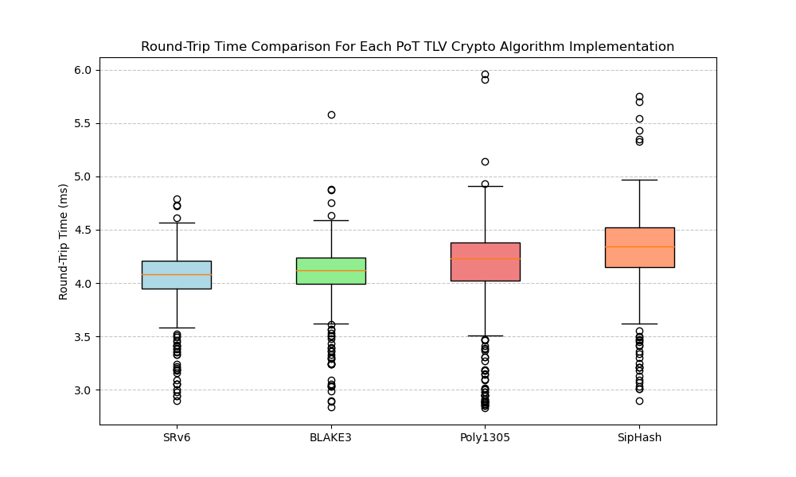

<h1 align="center">SRv6 Proof-of-Transit TLV</h1>
<h3 align="center">Based on SipHash, Poly1305 and BLAKE3 keyed-hash functions</h3>

```bash
                 0                   1                   2                   3
                 0 1 2 3 4 5 6 7 8 9 0 1 2 3 4 5 6 7 8 9 0 1 2 3 4 5 6 7 8 9 0 1
                +-+-+-+-+-+-+-+-+-+-+-+-+-+-+-+-+-+-+-+-+-+-+-+-+-+-+-+-+-+-+-+-+-
                |   Type (8b)   |  Length (8b)  |      Reserved/Flags (16b)      |
                +-+-+-+-+-+-+-+-+-+-+-+-+-+-+-+-+-+-+-+-+-+-+-+-+-+-+-+-+-+-+-+-+-
                |                          Nonce (96b)                           |
                +-+-+-+-+-+-+-+-+-+-+-+-+-+-+-+-+-+-+-+-+-+-+-+-+-+-+-+-+-+-+-+-+-
                |                      Witness (64-256b)                         |
                |                            ...                                 |
                +-+-+-+-+-+-+-+-+-+-+-+-+-+-+-+-+-+-+-+-+-+-+-+-+-+-+-+-+-+-+-+-+-
                |                       Root (64-256b)                           |
                |                            ...                                 |
                +-+-+-+-+-+-+-+-+-+-+-+-+-+-+-+-+-+-+-+-+-+-+-+-+-+-+-+-+-+-+-+-+-
```

This project demonstrates a mechanism for achieving **Proof-of-Transit (PoT)** in an **SRv6 (Segment Routing over IPv6)** network using **eBPF  (Extended Berkeley Packet Filter)** attached to Linux **TC (Traffic Control)** and **XDP (eXpress Data Path)** hooks.

The core idea is to embed a custom **Type-Length-Value (TLV)** object within the **Segment Routing Header (SRH)** through all nodes in the path. This **TLV** contains metadata (random nonce) and two cryptographic hashs (computed through the fast **SipHash**, **Poly1305** and **BLAKE3 Keyed-hash** algorithms) that allows downstream nodes to verify the path taken by the packet.

## Getting Started

<details>
  <summary style="font-size: 16px;"><strong>Compiling the BTF bytecode and the CLI tool</strong></summary>

  #### Requirements

  * **Linux Kernel:** Version supporting eBPF, TC BPF, XDP, and SRv6.
  * **libbpf-dev:** Development headers for libbpf, same as the Kernel.
  * **iproute2:** For managing TC filters and XDP programs.
  * **clang/llvm:** For compiling C code to eBPF bytecode.

  #### Compiling

  ```bash
  # Install Linux Kernel headers and tools
  apt install linux-image-$(uname -r) linux-headers-$(uname -r) linux-tools-$(uname -r)

  # Install required libraries
  apt install clang llvm libbpf-dev libelf-dev make

  # Compile the project
  make all
  ```
</details>
<details open>
  <summary style="font-size: 16px;"><strong>Usage options and key management</strong></summary>

  ```bash
  Usage:
    seg6-pot-tlv --load <iface>
        Loads & attaches the eBPF XDP and TC programs to <iface> and pins the maps.

    seg6-pot-tlv --sid <sid> --key <key>
        Updates the pinned map with <sid> (IPv6) with the related <key> (max 32B).

    seg6-pot-tlv --keys
        Shows all the keys pinned on the key map with their related SID.

  Examples:
    sudo ./seg6-pot-tlv --load ens5
    sudo ./seg6-pot-tlv --sid 2001:db8:ff:1::1 --key 00112233445566778899aabbccddeeff00112233445566778899aabbccddee11
  ```
</details>
<details>
  <summary style="font-size: 16px;"><strong>Debugging TLV logs and operations</strong></summary>

  ```bash
  # Monitor eBPF logs
  bpftool prog trace

  # Monitor SRv6 packets
  tcpdump -pni any "ip6[6]==43" -vvv -x
  tshark -i any -p -f "ip6[6]==43" -V -x
  ```
</details>
<details>
  <summary style="font-size: 16px;"><strong>Setting-up DEMO scenario for tests</strong></summary>

  - [topology/README.md](topology/README.md)
</details>

## Preliminary Results

<div align="center"></div>

## Warning Notice

> [!IMPORTANT]
>
> The following work and its results are the artefacts of a project presented for the Network Security class on a Master's in Computer Science from State University of Londrina (UEL) in order to obtain a good grade on the subject.
>
> This repository is created **solely for educational purposes**. The content provided here is intended to serve as examples and study material. **There are no guarantees that the code or any other material is suitable or safe for production use**.
>
> If you choose to use any part of this project in a production environment, **you do so at your own risk**. It is strongly recommended to thoroughly review the code and implement proper testing before any production use.

## Must Read References

- **IETF (2025).** *[Segment Routing over IPv6 (SRv6) Security](https://datatracker.ietf.org/doc/draft-ietf-spring-srv6-security/)*
- **Iannone, L. (2024).** *[Segment Routing over IPv6 Proof of Transit](https://datatracker.ietf.org/meeting/119/materials/slides-119-spring-srv6-proof-of-transit-00)*
- **Borges, R. et al. (2023).** *[In-situ Proof-of-Transit for Path-Aware Programmable Networks.](https://ieeexplore.ieee.org/document/10175482)*
- **Hara, Y. et al. (2025).** *[eBPF-Based Ordered Proof of Transit for Trustworthy Service Function Chaining.](https://ieeexplore.ieee.org/document/10924210)*
- **Borges, R. et al. (2024).** *[PoT-PolKA: Let the Edge Control the Proof-of-Transit in Path-Aware Networks.](https://ieeexplore.ieee.org/document/10500862)*
- **Martinez, A. et al. (2024).** *[Implementation of a Traffic Flow Path Verification System in a Data Network.](https://ieeexplore.ieee.org/document/10597042)*
- **Martinello, M. et al. (2024).** *[PathSec: Path-Aware Secure Routing with Native Path Verification and Auditability.](https://ieeexplore.ieee.org/document/10807493)*

