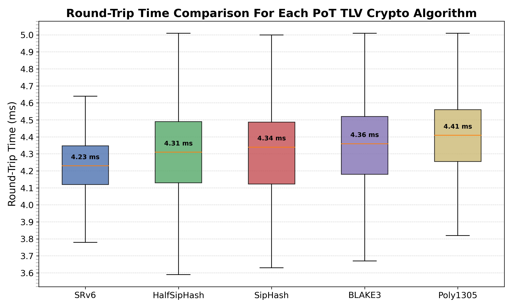

# Evaluating results

1. First we'll need to collect each algorithm round-trip times
```bash
# Run all tests
./topology/scripts/evaluate.sh

# Copy artefacts for evaluation
scp root@192.168.0.57:/root/qemu-virtual-srv6/rtt_data.zip ./tests/round-trip-time/
cd ./tests/round-trip-time/
unzip rtt_data.zip
mv rtt_data/* ./results
rm -r rtt_data/ rtt_data.zip
```

2. Then plot each dataset in a boxplot to compare then visually

```bash
# Run the evaluation
python3 evaluate-round-trip-time.py

# Then see the results
open round-trip-time.png
```

3. Preliminary results

<div align="center"></div>
