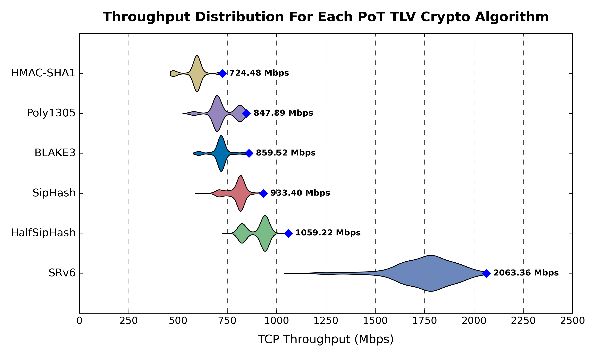

# Evaluating throughput

1. First we'll need to collect each algorithm round-trip times
```bash
# Run all tests
./topology/scripts/evaluate.sh

# Copy artefacts for evaluation
scp root@192.168.0.57:/root/qemu-virtual-srv6/throughput_data.zip ./tests/throughput/
cd ./tests/throughput/
unzip throughput_data.zip
mv throughput_data/* ./results
rm -r throughput_data/ throughput_data.zip
```

2. Then plot each dataset in a boxplot to compare then visually

```bash
# Run the evaluation
python3 evaluate-throughput.py

# Then see the results
open throughput.png
```

3. Preliminary results

<div align="center"></div>
