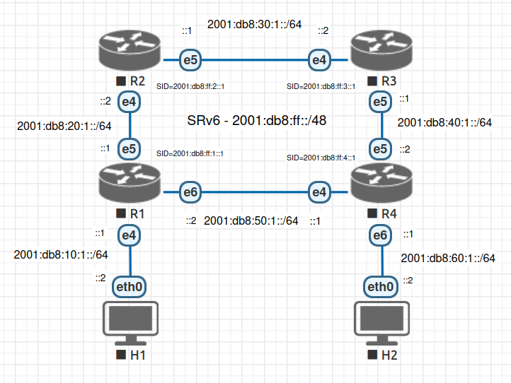

# QEMU SRv6 LAB

<div align="center"></div>

# Setup Instructions

Fresh installation of Debian 12:

```bash
apt install wget qemu-system ansible sshpass bridge-utils
wget https://cloud-images.ubuntu.com/releases/noble/release-20240423/ubuntu-24.04-server-cloudimg-amd64.img -O base.img
./topology.sh
ansible-playbook -i inventory playbook.yml
```

# eBPF load

R1 install bpftool:

```bash
apt install tcpdump linux-tools-common linux-tools-generic linux-tools-6.8.0-31-generic
```

R1 compile ebpf itself
```bash
qemu-img resize r1/r1.img +10G
apt install libbpf-dev clang
ln -s /usr/include/x86_64-linux-gnu/asm /usr/include/asm
clang -O2 -g -target bpf -Wextra -I/usr/include/ -c seg6_blake3_pot_tlv.c -o seg6_blake3_pot_tlv.o
```

Load eBPF XPD
```bash
bpftool prog load seg6_blake3_pot_tlv.o /sys/fs/bpf/seg6_blake3_pot_tlv type xdp
bpftool net attach xdp pin /sys/fs/bpf/seg6_blake3_pot_tlv dev ens5
```

Unload eBPF XPD
```bash
bpftool net detach xdp dev ens5
rm /sys/fs/bpf/seg6_blake3_pot_tlv
```

Load eBPF TC
```bash
tc qdisc add dev ens5 clsact
tc filter add dev ens5 egress bpf da obj seg6_blake3_pot_tlv.o sec classifier/egress
```

Unload eBPF TC
```bash
tc qdisc delete dev ens5 clsact
```

Monitor eBPF logs
```bash
bpftool prog trace
```
