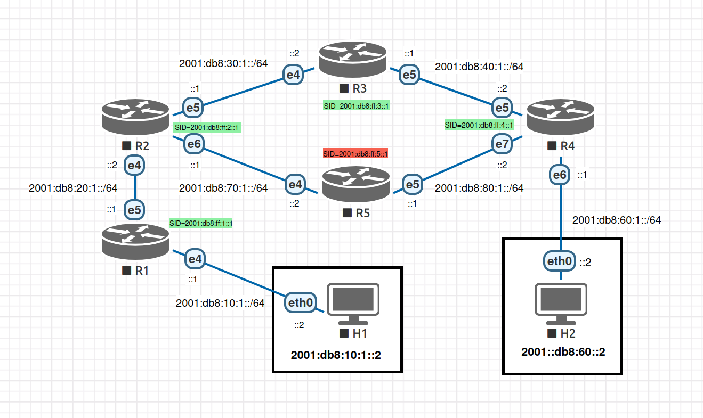

# QEMU SRv6 LAB

<div align="center"></div>

# Setup Instructions

Fresh installation of Debian 12:

```bash
apt install wget qemu-system ansible sshpass bridge-utils
wget https://cloud-images.ubuntu.com/releases/noble/release-20240423/ubuntu-24.04-server-cloudimg-amd64.img -O base.img
./topology.sh
ansible-playbook -i inventory playbook.yml
```

## R1 compile ebpf itself
```bash
qemu-img resize r1/r1.img +10G
apt install libbpf-dev clang
ln -s /usr/include/x86_64-linux-gnu/asm /usr/include/asm
```